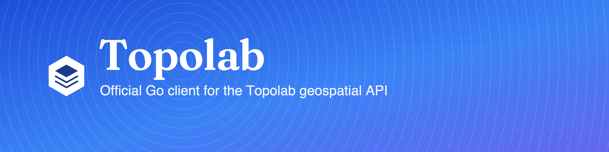

<p align="center">
  
</p>

<p align="center">
  <a href="https://pkg.go.dev/github.com/topolab-bv/topolab-go"></a>
  <a href="https://goreportcard.com/report/github.com/topolab-bv/topolab-go"></a>
  <a href="https://github.com/topolab-bv/topolab-go/actions/workflows/ci.yml"></a>
  <a href="LICENSE"></a>
  <a href="https://docs.topolab.nl"></a>
</p>

<h1 align="center">topolab-go</h1>

<p align="center">
  The official <b>Go</b> client for the <a href="https://topolab.nl">Topolab</a> dataset and geospatial API.<br>
  Lightweight, GeoJSON-first, context-aware, zero dependencies.
</p>

---

📖 **Docs:** [pkg.go.dev/github.com/topolab-bv/topolab-go](https://pkg.go.dev/github.com/topolab-bv/topolab-go) · [topolab-bv.github.io/topolab-go](https://topolab-bv.github.io/topolab-go/) · full platform docs at [docs.topolab.nl](https://docs.topolab.nl)

## Install

```bash
go get github.com/topolab-bv/topolab-go
```

Requires Go 1.23+ (for the range-over-func iterator). No third-party
dependencies — only the standard library.

## Quickstart

```go
package main

import (
	"context"
	"fmt"
	"log"

	topolab "github.com/topolab-bv/topolab-go"
)

func main() {
	tl, err := topolab.New(topolab.WithAPIKey("tlb_prod_..."))
	if err != nil {
		log.Fatal(err)
	}
	// Page Domino's locations within an Amsterdam bounding box.
	fc, err := tl.Dataset("nl-domino-poi").Items(context.Background(), &topolab.ItemsOptions{
		Limit: 100,
		BBox:  []float64{4.7, 52.2, 5.1, 52.5},
	})
	if err != nil {
		log.Fatal(err)
	}
	fmt.Printf("%d locations\n", len(fc.Features))
}
```

Your API key carries your scope and add-ons — spatial queries need `GIS_ACCESS`,
downloads need `API_ACCESS`, and data routes require an organization-scoped key.
Pass `WithAPIKey` or set `TOPOLAB_API_KEY`:

```go
tl, err := topolab.New() // reads TOPOLAB_API_KEY
```

## Staging vs production

The client targets **production** (`https://api.topolab.nl`) by default. Point it
at staging with `WithEnvironment`:

```go
tl, _ := topolab.New(topolab.WithEnvironment("staging")) // https://api-staging.topolab.nl
```

Or set `TOPOLAB_ENV=staging`. An explicit `WithBaseURL` always wins. Precedence:
`WithBaseURL` → `WithEnvironment` → `TOPOLAB_BASE_URL` → `TOPOLAB_ENV` → production.

## What you can do

### Browse the catalog

```go
page, _ := tl.Datasets.List(ctx, &topolab.ListOptions{Country: "NL", Limit: 10})
```

### Query features in an area (spatial, paged)

```go
fc, _ := tl.Dataset("nl-domino-poi").Items(ctx, &topolab.ItemsOptions{
	Limit: 100, BBox: []float64{4.7, 52.2, 5.1, 52.5},
})
```

Stream every feature, paging transparently (Go 1.23 range-over-func):

```go
for f, err := range tl.Dataset("nl-domino-poi").IterItems(ctx, &topolab.IterOptions{PageSize: 500}) {
	if err != nil {
		return err
	}
	lon, lat, _ := f.Geometry.Point()
	_ = lon; _ = lat
}
```

Or fetch everything at once — remaining pages are pulled **concurrently**:

```go
all, _ := tl.Dataset("nl-domino-poi").ItemsAll(ctx, &topolab.IterOptions{PageSize: 500})
// ...add Sequential: true to page one at a time.
```

### Pull a whole dataset (bulk)

```go
fc, _ := tl.Dataset("nl-domino-poi").ToGeoJSON(ctx)                  // FeatureCollection
_ = tl.Dataset("nl-domino-poi").Download(ctx, "dominos-nl.geojson", "geojson")
```

`Download` creates the destination directory, streams to a temp file, and renames
atomically — an interrupted transfer never leaves a truncated file.

## Errors

Every API failure is a `*topolab.Error` carrying a `Kind`. Match a category with
`errors.Is`, and read details with `errors.As`:

```go
import "errors"

_, err := tl.Dataset("nl-domino-poi").ToGeoJSON(ctx)
if errors.Is(err, topolab.ErrAddonRequired) {
	var e *topolab.Error
	errors.As(err, &e)
	fmt.Println("your key needs:", e.Addon)
}
```

| Sentinel | Kind | When |
|---|---|---|
| `ErrAuthentication` | `authentication` | missing/invalid API key (401) |
| `ErrAddonRequired` | `addon_required` | key lacks the add-on — `.Addon` names it (403) |
| `ErrAccessDenied` | `access_denied` | dataset not accessible to your org (403) |
| `ErrInsufficientCredit` | `insufficient_credits` | `.Required` / `.Available` (402) |
| `ErrNotFound` | `not_found` | unknown dataset or collection (404) |
| `ErrValidation` | `validation` | bad parameters (400/4xx) |
| `ErrRateLimit` | `rate_limit` | `.RetryAfter`, retried automatically (429) |
| `ErrConfiguration` | `configuration` | client misconfiguration |
| `ErrServer` | `server` | upstream error (5xx), retried |
| `ErrConnection` | `connection` | network failure / cancellation |

Transient statuses (429, 5xx) and network errors are retried with exponential
backoff (`WithMaxRetries`, default 3 retries after the first attempt).

## Collections are addressed by slug

The OGC `collectionId` is the dataset's `table` slug (e.g. `nl-domino-poi`) — the
same value you pass to `Dataset()`. The client calls
`/v1/ogc/collections/{slug}/items` directly; there is no slug→uuid resolution.

## Documentation

- **API reference:** [pkg.go.dev/github.com/topolab-bv/topolab-go](https://pkg.go.dev/github.com/topolab-bv/topolab-go)
- **Guide:** [topolab-bv.github.io/topolab-go](https://topolab-bv.github.io/topolab-go/)
- **Platform docs:** [docs.topolab.nl](https://docs.topolab.nl)
- A runnable example lives in [`examples/quickstart`](examples/quickstart).

## License

[MIT](LICENSE) © Topolab B.V.
